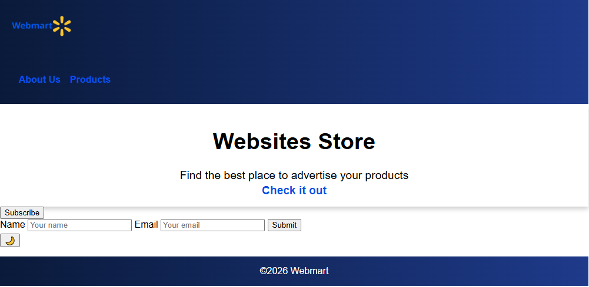
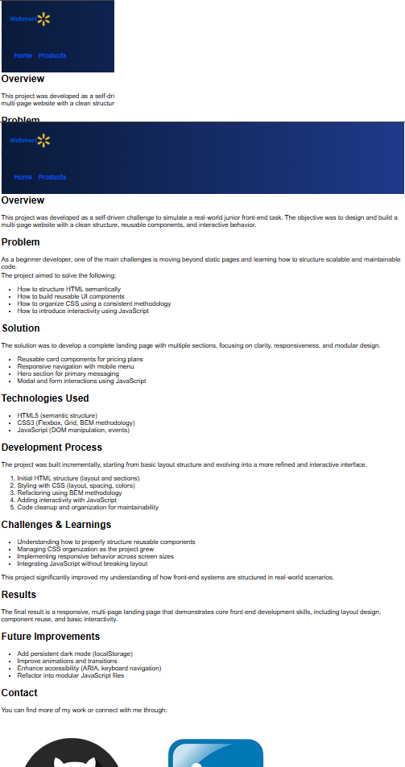

# Webmart — Product Landing Page

A responsive multi-page front-end project focused on reusable UI components, clean CSS architecture, and JavaScript interactivity.

---

## Live Demo

[View Project](https://celinorfonseca.github.io/webmart-product-landing-page/)

---

## Overview
Webmart is a self-driven project designed to simulate a real-world junior front-end development task.  

The goal was to build a structured, maintainable, and responsive landing page while applying modern HTML, CSS, and JavaScript practices.

---

## Problem
As a beginner developer, moving from static pages to scalable and maintainable code can be challenging.

This project focused on solving:
- Structuring semantic HTML
- Creating reusable UI components
- Organizing CSS using a consistent methodology
- Adding interactivity without breaking layout

---

## Solution
The project was built as a multi-page landing page with:

- Reusable card components (pricing plans)
- Responsive navigation with mobile menu
- Hero section for main messaging
- Modal and form interactions using JavaScript

---

## Technologies Used
- HTML5 (semantic structure)
- CSS3 (Flexbox, Grid, BEM methodology)
- JavaScript (DOM manipulation, events)

---

## Features
- Responsive layout
- Mobile navigation menu
- Modal interaction
- Form validation
- Dark mode toggle
- Reusable UI components

---

## Development Process
The project was developed incrementally:

1. Initial HTML structure
2. CSS layout and styling
3. Refactoring with BEM methodology
4. Adding JavaScript interactivity
5. Code cleanup and organization

---

## Challenges & Learnings
- Structuring scalable CSS as the project grew
- Avoiding repetition by creating reusable components
- Implementing responsive layouts effectively
- Integrating JavaScript behavior into UI

> One key learning was transitioning from duplicated styles to a more structured BEM-based approach.

---

## Results
The final result is a responsive, multi-page landing page demonstrating:

- Component-based design
- Clean and organized CSS
- Functional JavaScript interactions

---

## Future Improvements
- Persist dark mode using localStorage
- Improve animations and transitions
- Enhance accessibility (ARIA, keyboard navigation)
- Modularize JavaScript files

---

## Project Structure
```
project-folder/
│── index.html
│── products.html
│── about-us.html
│── css/
│     └── style.css
│── js/
│     └── script.js
│── assets/
│     └── images/
│── README.md
```

## Screenshots

### Desktop View


### Mobile View


### Products Section


### About Page


---

## Author
Celinor Lima da Fonseca Júnior  

- GitHub: https://github.com/celinorfonseca  
- LinkedIn: https://www.linkedin.com/in/celinor-lima-da-fonseca-junior/