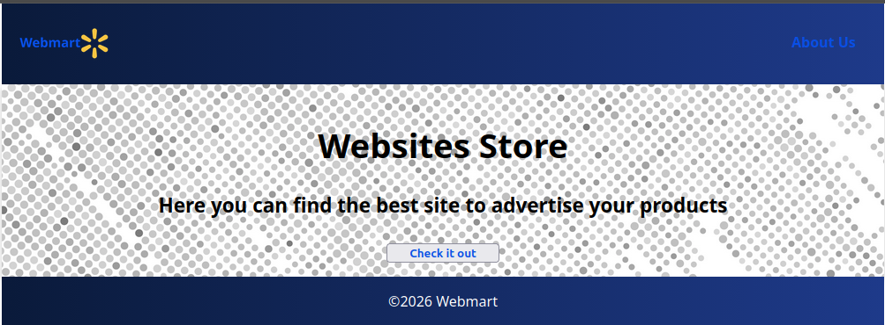
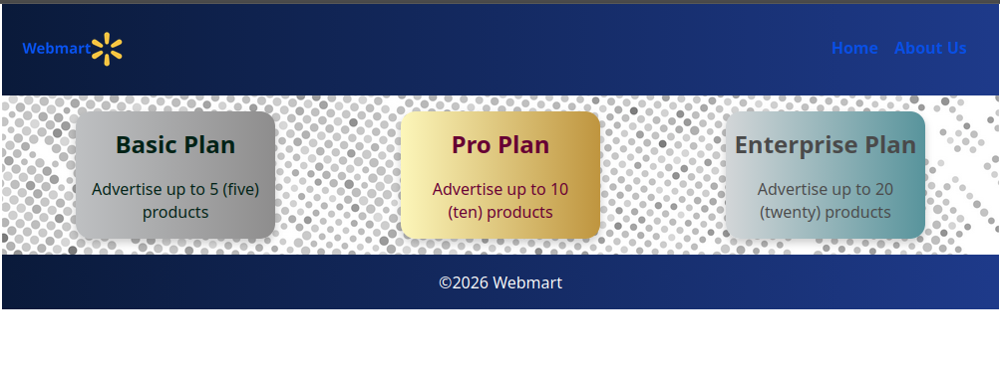
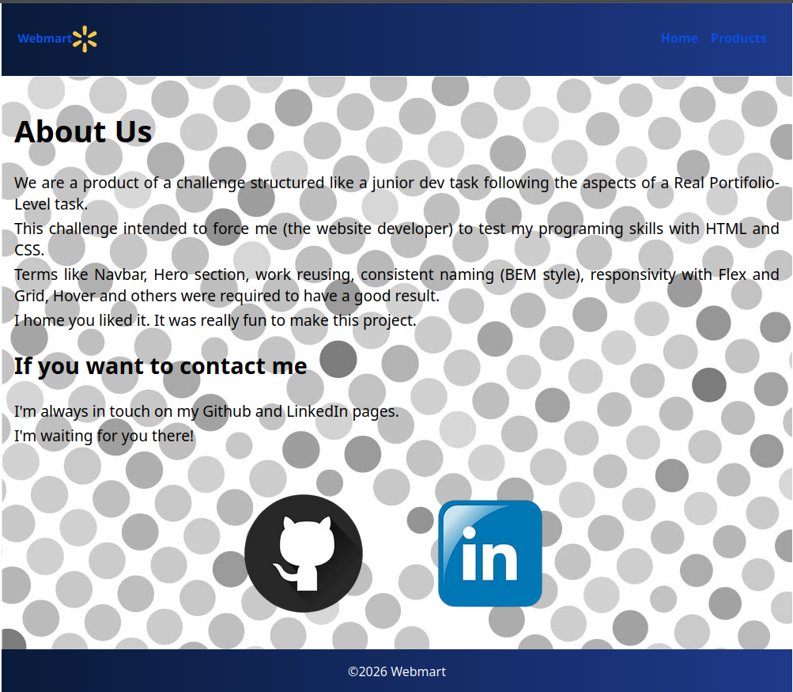

# Webmart - Product Landing Page

A responsive web page built with HTML and CSS featuring a navbar,HERO section, product cards and footer.

On last Edition I started including JavaScript on the project.
Using options like forms and dark mode button.

---

## Features
- Responsive layout using Flexbox and Grid
- Reusable card components (BEM methodology)
- Hover effects for better user interaction

---

## Technologies Used
- HTML5
- CSS3 (Flexbox, Grid)

---

## Preview
<!-- Add screenshot here later -->




---

## Project Structure
```
project-folder/
│── about-us.html
│── index.html
│── products.html
│── css/
│     └── style.css
│── assets/
│     └── images
│── js/
│     └── scripts.js
│── README.md
```

---

## How to Run
1. Clone the repository:
```
git clone https://github.com/celinorfonseca/webmart-product-landing-page
```

2. Open the project folder

3. Open `index.html` in your browser

---

## Purpose

This project was built to practice responsive layout, reusable components, and multi-page website structure using HTML and CSS.

---

## What I Learned
- How to structure a webpage using semantic HTML
- How to use Flexbox and Grid for layout
- How to apply BEM for scalable CSS
- How to build reusable UI components
- How to use background images and Gradient Colors
- how to use images as link buttons

---

## Future Improvements
- Improve responsiveness for smaller devices
- Add animations and transitions
- Introduce JavaScript for interactivity

---

## Author
Celinor Lima da Fonseca Júnior